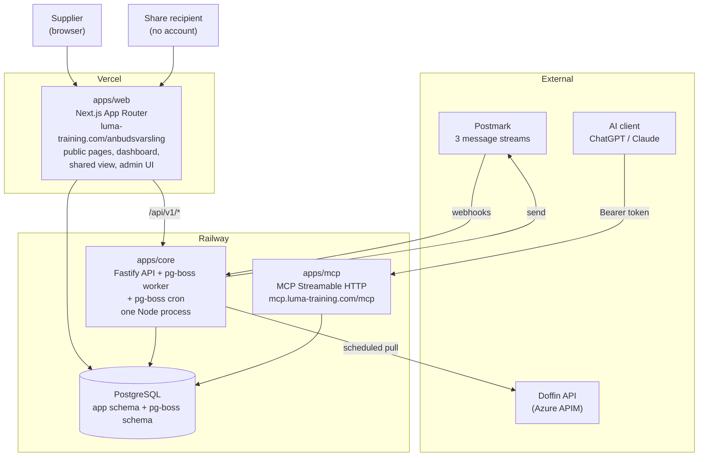
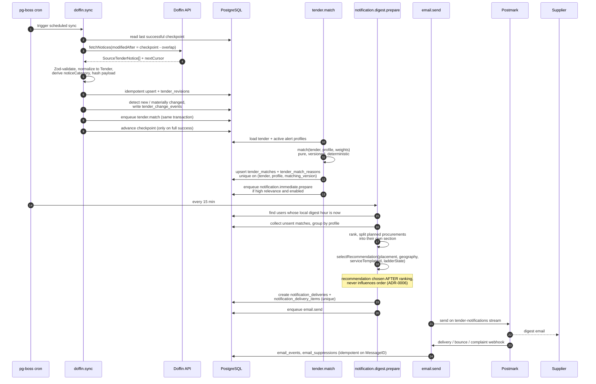
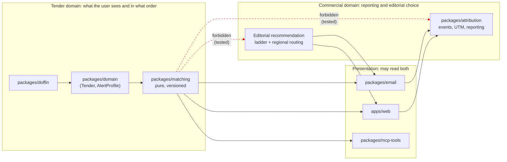

# Architecture: Luma Anbudsvarsling

This is the document to read first. It describes what the system is, how it is split, how data moves through it, and where the boundaries are that must not be crossed.

The authoritative product specification is `Luma_Anbudsvarsling_IDE_Agent_Specification_v2.md` in the repository root (Norwegian, 54 sections). Where this document and the spec disagree, the spec wins, except where an ADR in `docs/adr/` records a deliberate deviation. Two such deviations exist and are noted below.

## 1. What the system does

Luma Anbudsvarsling is a free Norwegian public-tender alert service from Luma Training. It:

1. Ingests tender notices from the Norwegian Doffin API on a schedule.
2. Normalizes them into a source-neutral model and detects material changes.
3. Matches them deterministically against user-defined alert profiles, producing an explanation for every match.
4. Sends daily, weekly and immediate email digests through Postmark.
5. Presents matches in a web dashboard, including a separate category for planned procurements.
6. Lets users share a single tender through a public, unauthenticated link.
7. Exposes a remote MCP server so users can query their tenders from ChatGPT, Claude or any MCP client.

It is simultaneously Luma Training's marketing surface toward the supplier market. That second job is real, funded and instrumented, and it is **structurally separated** from the first. See section 5.

## 2. Deployment topology

Three deployed services plus one database. ADR-0001 records why, including why the spec's five apps collapse to three.



| Service | Platform | Responsibility | Why here |
| --- | --- | --- | --- |
| `apps/web` | Vercel | Public pages, authenticated dashboard, shared view, admin UI, server actions | Next.js-native hosting and preview deployments |
| `apps/core` | Railway | Fastify HTTP API, pg-boss worker, pg-boss cron schedules | Long-running processes. Spec §36 forbids running Doffin ingest as a request-bound Vercel function |
| `apps/mcp` | Railway | MCP Streamable HTTP server | Isolated so a live demo never queues behind ingest or digest load (ADR-0001, ADR-0002) |
| PostgreSQL | Railway | Application data and the pg-boss job tables | One stateful service; transactional job enqueue (ADR-0008) |

**Two deliberate deviations from the spec:**

- The admin routes are at `/anbudsvarsling/admin/...`, not §16's `/admin/anbudsvarsling/...`. `apps/web` is served under one Next `basePath`, which can only put the prefix in front of every route, so the two forms cannot both come out of it. Every public and signed-in route matches §16 exactly. The service is reached at `luma-training.com/anbudsvarsling` through a rewrite on the marketing site (`docs/deployment.md` §7).
- The Doffin credential environment variable is `DOFFIN_SUBSCRIPTION_KEY`, matching the Azure APIM subscription-key style, not the spec's generic `DOFFIN_API_KEY` (ADR-0007).

## 3. Where things live

A package exists where code is shared between deployments or where a boundary is load-bearing. Where neither is true, the code is a service module inside `apps/core` instead — see the note below the table, which records where this departs from spec §35.

| Package | Responsibility | Notable constraint |
| --- | --- | --- |
| `packages/domain` | Core types (`Tender`, `AlertProfile`, `MatchResult`), Norwegian text folding, CPV hierarchy, consent derivation, editorial eligibility | No I/O, one dependency (Zod). The bottom of the graph, and the vocabulary everything else speaks |
| `packages/db` | Drizzle schema, migrations, connection pooling, test harness | Single owner of the schema. `drizzle-kit` migrations are the only way it changes |
| `packages/doffin` | `TenderSourceAdapter`, `DoffinApiAdapter`, `FixtureTenderSourceAdapter`, normalisation, the incremental sync | The only place that knows Doffin field names (ADR-0007) |
| `packages/matching` | Deterministic, versioned matching and explanation | Pure. An automated scan asserts no import edge to anything commercial (ADR-0004, ADR-0006) |
| `packages/email` | Postmark client, the nine templates, stream mapping, promotion placement | Callers name a template, never a stream. Marketing sends require a consent proof object (ADR-0005) |
| `packages/auth` | Magic-link issuance and redemption, opaque database-backed sessions, role and ownership checks | Pure logic behind two persistence ports, so all three runtimes validate identically (ADR-0016) |
| `packages/mcp-tools` | The nine MCP tools, resources, prompts, and the repository ports they read through | Imports no database client. `apps/mcp` supplies the adapter (ADR-0002) |
| `packages/content` | The eight service templates, the service category list and the editorial recommendation seeds | Editorial content, quality-assured by Luma before launch (spec §11.2) |
| `packages/ui` | Design tokens and accessible React primitives | Tokens are the only colour source, enforced by a WCAG contrast test |
| `packages/config` | Zod-validated environment, per service | Errors name the failing key and the rule, never the received value (spec §47) |
| `packages/observability` | pino logging with two layers of redaction, correlation IDs, health and readiness | Never logs a token, magic link or share token in clear (spec §47) |

**Where this departs from spec §35.** The spec lists `billing`, `consent`, `legal`, `sharing` and `attribution` as packages. They are implemented as service modules under `apps/core/src/services/` instead, because each is used by exactly one deployment and a package boundary would buy nothing but indirection. The constraints they carry are unchanged and still enforced: `consent_events` is append-only at the database level, `order_requests` moves only through the `BillingProvider` seam, the shared view is built from a schema that strips undeclared fields, and nothing in the matching path reads attribution. If any of them is later needed by a second deployment, promoting it to a package is a move, not a rewrite.

Rule: nothing under `packages/` may import from `apps/`. This is why the MCP auth helpers and resource content live in `packages/mcp-tools` with thin re-export barrels in `apps/mcp`, rather than the other way round.

## 4. Data flow

### 4.1 The pipeline in one line

```
Doffin API -> ingest -> normalize -> change detect -> match -> notify -> email / dashboard / MCP
```

Every stage is a pg-boss job except the first scheduling tick and the read surfaces. Jobs are at-least-once with idempotency keys, so a retry is safe at every stage (ADR-0008).

### 4.2 Ingest to digest, in detail



Two properties in that diagram carry most of the correctness weight:

- **The checkpoint advances only after a fully successful run** (spec §12). A partial failure leaves the checkpoint where it was, and the overlapping time window means the next run re-reads the same notices. Re-reading is harmless because the upsert is idempotent and keyed on `sourcePayloadHash`.
- **`enqueue tender.match` shares the transaction with the upsert.** This is the reason for a Postgres-backed queue rather than a separate broker (ADR-0008). A crash between the two writes cannot leave tenders ingested but unmatched.

### 4.3 Read surfaces

All three read surfaces present the same match data with different projections:

| Surface | Auth | Match explanation shown | Promotion |
| --- | --- | --- | --- |
| Dashboard (`apps/web`, authenticated) | Session cookie (ADR-0016) | Full: reason types, labels, contributions, evidence, profile values | Editorial block on tender detail and empty states |
| Email digest | Delivered by address | Two or three main reasons per card | Editorial block in the footer, after all tender content, switchable off |
| Shared view (`/delt/[token]`, public) | Share token | Reason **types** only, never profile values | Single invitation block, nothing else |
| MCP (`apps/mcp`) | Bearer token (ADR-0003) | Full, through `explain_tender_match` | None in search tools. Luma content only through `get_luma_learning_resource` |

## 5. The trust boundary

This is the part of the architecture that is a product decision rather than a technical one, and it is the part most likely to erode quietly.

The service has two jobs (spec §1): solve the supplier's problem, and be a measurable marketing surface for Luma Training. The order is absolute, and the customer-facing promise is explicit (spec §43): "Kurs, annonser eller kommersielle hensyn påvirker aldri hvilke anbud du får se."

That promise is enforced as a **module boundary with no import edge**, not as a convention.



Concretely:

- `packages/matching` has no import edge, direct or transitive, to `packages/attribution` or the editorial module. A test walks the dependency graph and fails the build on any such edge.
- `MatchResult` has exactly the eight fields in spec §14. There is no `sponsored`, no `campaignId`, no `commercialValue`.
- Ranking happens first; the editorial recommendation is chosen afterwards, from placement, profile geography, service template and ladder state. It never sees the match list.
- `attribution_events` has no foreign key into the match tables beyond `tenderId` for reporting (spec §37).
- Two users with identical profiles and wildly different commercial histories get byte-identical `MatchResult` values. That is a test, not an aspiration.
- Turning off promotion changes email content and nothing about which tenders are sent or their order.

ADR-0006 and ADR-0014 hold the reasoning and the full verification list.

## 6. Cross-cutting decisions

**Authentication** is described by **ADR-0016**: a custom passwordless magic-link flow with opaque, database-backed sessions, built on Node's `crypto` primitives. `packages/auth` is the **single owner of the sessions and magic-link tables** and exports the one `validateSession` function that all three runtimes call. MCP calls authenticate separately with bearer tokens (ADR-0003), resolved into the same `SecurityContext` shape.

**Consent** is an append-only event log (ADR-0009). Current status is derived from the latest event; nothing is ever updated in place. Marketing consent and tender alerting are independent switches, and turning one off never touches the other.

**Legal documents** are immutably versioned with an insert-only acceptance history (ADR-0011). Startup fails if the configured current version does not exist.

**Email** goes out on three Postmark streams (ADR-0005) so a marketing complaint can never suppress a magic login link.

**Language:** all customer-facing text is Norwegian bokmål; code, schema, logs and these ADRs are English (ADR-0012). No i18n framework, no language selector.

**Billing** in the MVP is a structured order request handled manually, behind a `BillingProvider` interface (ADR-0010). No Stripe dependency exists in the repository. Phase 7's model sketch is in `docs/phase-7-billing-reference.md`.

## 7. Technology

| Concern | Choice | Version note |
| --- | --- | --- |
| Runtime | Node.js | `>= 22` |
| Language | TypeScript, strict, no `any` | 5.7 |
| Monorepo | pnpm workspaces + turborepo | pnpm 10.28 |
| Web | Next.js App Router | 16.2.12 |
| API | Fastify | 5.11.2 |
| ORM / migrations | Drizzle + drizzle-kit | drizzle-orm 0.45.2 |
| Queue and cron | pg-boss on the same PostgreSQL | 12.x, pinned line (ADR-0008) |
| Validation | Zod | 4.4.3 |
| Email | Postmark SDK | 5.1.0 |
| MCP | `@modelcontextprotocol/sdk` | 1.30.0, exact pin (ADR-0002) |
| Logging | pino, JSON, with redaction | 10.3.1 |
| Tests | Vitest (unit, integration), Playwright (end-to-end) | |

## 8. Operational notes

Platform configuration and the per-service environment variable inventory are in [`deployment.md`](deployment.md).

- `apps/core` and `apps/mcp` each expose `/health`, `/ready` and a protected `/metrics` (spec §47).
- Correlation IDs propagate from the web request through the API into job payloads, so a digest can be traced back to the ingest run that produced its matches.
- Never logged: full MCP tokens, magic links, share tokens in clear, full user prompts, full tender document text (spec §47).
- Alerting covers failed Doffin sync, abnormal data stoppage, complaint spikes, auth failures, queue depth and oldest-job age, and the order backlog.
- Admin can re-run ingest, reprocess tenders, re-run matching, suppress an invalid tender, revoke MCP tokens and share links, and handle orders. Everything is written to `admin_audit_events` (spec §45).

## 9. Build order

Spec §50 defines eight phases. Phases 0 through 6 reach launch; 7 and 8 follow.

| Phase | Delivers | Key gate |
| --- | --- | --- |
| 0 | Monorepo, CI, environment validation, architecture docs, all ADRs, Vercel and Railway skeletons | All apps build, health endpoints respond |
| 1 | Schema, migrations, adapter interface, fixture adapter, sync job, normalization | Idempotent re-ingest, correct `noticeCategory`, safe checkpoint. **Also: verify whether real award notices expose supplier name and contract duration, and update ADR-0013** |
| 2 | Passwordless auth, legal versioning, consent model | Signup without marketing consent; withdrawal creates a new event |
| 3 | Alert profiles, service templates, matching, dashboard | Deterministic and explainable; exclusions override; no commercial signal in ranking |
| 4 | Postmark, digests, promotion, sharing, attribution | No duplicate emails; promotion after tenders and switchable off; shared view leaks nothing |
| 5 | MCP server, tokens, slim tool surface, resources, prompts | Connects in ChatGPT and Claude; user isolation; five-minute demo runs stably |
| 6 | Security review, accessibility, legal content, backup, monitoring, order flow | The 14 launch blockers in spec §51 |
| 7 | Full billing system, full MCP surface | Order volume proves the need (ADR-0010) |
| 8 | Award watching, framework expiry | Gated on the ADR-0013 data verification from phase 1 |

## 10. Open questions

These are genuinely undecided, with the criteria that will settle them.

1. **Do Doffin award notices expose supplier name and contract duration, and at what fill rate?** Unverified. This is the gate for phase 8. To be answered against real data in phase 1 and recorded as an update to ADR-0013. Criteria are in that ADR.
2. **Retention of `consent_events` for deleted accounts.** Whether rows are kept with the user reference severed, or kept intact for a defined period, depends on Luma Training's retention policy and legal review of the privacy notice. Criterion: the shortest retention that still lets Luma demonstrate lawful basis for marketing already sent. Until then, deletion severs the reference and retains the event. See ADR-0009.
3. **Which Norwegian region codes constitute the Oslo region.** `OSLO_REGION_CODES` is configurable and its initial value is an editorial decision by Luma, tunable from attribution data once the full-day course promotion has run. See ADR-0014.
4. **Whether a pending terms re-acceptance should block the dashboard.** Current position is that it does not, on the reading that spec §3 forbids withholding tender data to force an action. Legal review may override. See ADR-0011.
